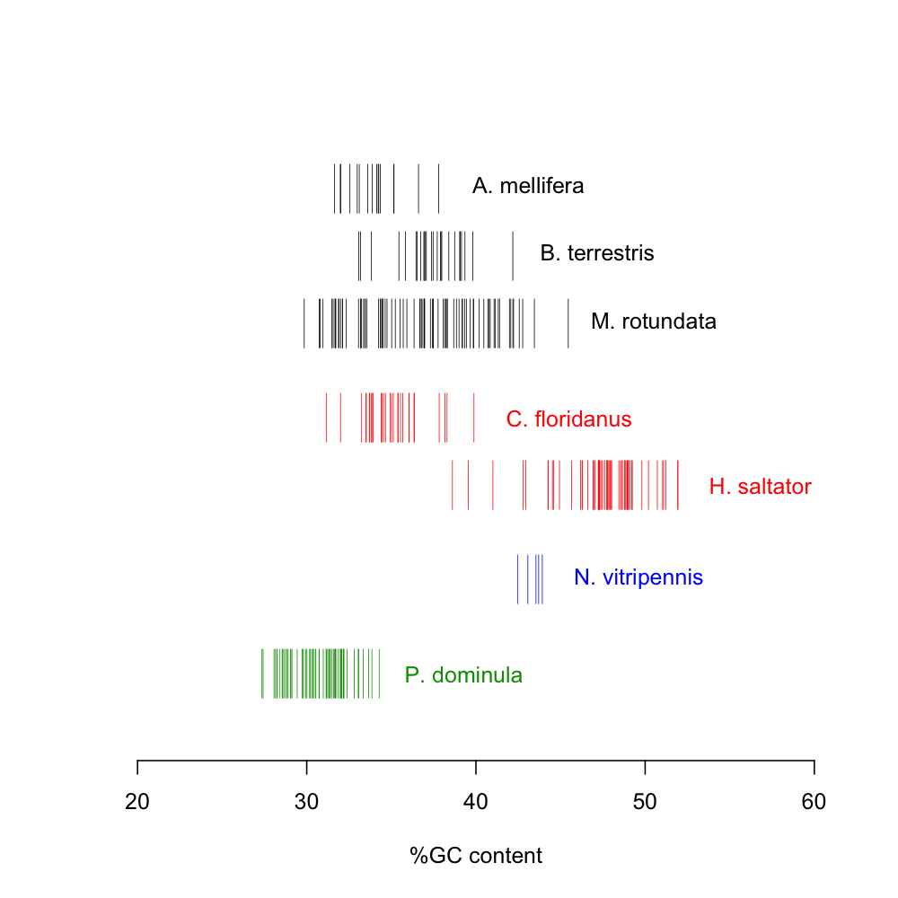

# Genome assembly

Raw DNA-Seq reads were groomed using [Trimmomatic][] version [0.22][], and the groomed reads were then assembled using [AllPaths-LG][] version [43216][].
The final assembly file has been deposited in the Pdom Data Store at `r1.2/genome-assembly/pdom-scaffolds-unmasked-r1.2.fa.gz`.

## Procedure (interactive)

### Short read quality control

First, designate the number of available processors to speed up Trimmomatic's computations.
Also, provide the path of the `trimmomatic-0.22.jar` file contained in the Trimmomatic source code distribution.

```bash
NumThreads=16
TrimJar=/usr/local/src/Trimmomatic-0.22/trimmomatic-0.22.jar
PdomData=/iplant/home/standage/Polistes_dominula
```

Now for the processing.
We apply the following filters to each read pair.

  - remove adapter contamination
  - remove any nucleotides at either end of the read whose quality score is below 3
  - trim the read once the average quality in a 5bp sliding window falls below 20
  - discard any reads which, after processing, fall below the length threshold (40bp for 100bp reads, 26bp for 35bp reads)

```bash
for sample in 200bp 500bp 1kb 3kb 8kb
do
  iget ${PdomData}/sequence/genome/pdom-gdnaseq-${sample}-1.fq.gz
  iget ${PdomData}/sequence/genome/pdom-gdnaseq-${sample}-2.fq.gz
  ./run-trim.sh $sample $TrimJar $NumThreads
done
```

### Assembly with AllPaths-LG

First, prepare a working directory for the assembly.

```bash
mkdir -p assembly/Polistes_dominula/data-trim
mv pdom-gdnaseq-*-trim-?.fq assembly/Polistes_dominula/data-trim/.
```

Next, convert the input files into the internal format required by AllPaths-LG.

```bash
PrepareAllPathsInputs.pl \
      DATA_DIR=assembly/Polistes_dominula/data-trim \
      PLOIDY=2
```

Then, execute the assembly procedure.

```bash
RunAllPathsLG PRE=assembly \
              REFERENCE_NAME=Polistes_dominula \
              DATA_SUBDIR=data-trim \
              RUN=run01 \
              TARGETS=standard
```

Finally, assign official project IDs to the scaffolds, compress, and clean up intermediate data files.

```bash
./scaff-ids.pl PdomSCFr1.2- \
    < $PRE/Polistes_dominula/data-trim/run01/ASSEMBLIES/test/final.assembly.fasta \
    > pdom-scaffolds-unmasked-r1.2.fa
gzip pdom-scaffolds-unmasked-r1.2.fa
rm -rf assembly pdom-gdnaseq*.fq*
```

### Comparison of genome composition

Compare the nucleotide composition of *Polistes dominula* with that of other Hymenoptera.
Only consider scaffolds/chromosomes/linkage groups 1 Mbp in length or greater.

```R
# Import data
am <- read.table("amel.seq.dstbn.csv", sep=",", header=FALSE)
bt <- read.table("bter.seq.dstbn.csv", sep=",", header=FALSE)
hs <- read.table("hsal.seq.dstbn.csv", sep=",", header=FALSE)
mr <- read.table("mrot.seq.dstbn.csv", sep=",", header=FALSE)
nv <- read.table("nvit.seq.dstbn.csv", sep=",", header=FALSE)
pd <- read.table("pdom.seq.dstbn.csv", sep=",", header=FALSE)

# Calculate GC content
am$GCcontent <- 100 * am$V3 / am$V2
bt$GCcontent <- 100 * bt$V3 / bt$V2
hs$GCcontent <- 100 * hs$V3 / hs$V2
mr$GCcontent <- 100 * mr$V3 / mr$V2
nv$GCcontent <- 100 * nv$V3 / nv$V2
pd$GCcontent <- 100 * pd$V3 / pd$V2

# Filter out sequences shorter than 1 Mbp
amel <- am[am$V4 >= 1000000,]
bter <- bt[bt$V4 >= 1000000,]
hsal <- hs[hs$V4 >= 1000000,]
mrot <- mr[mr$V4 >= 1000000,]
nvit <- nv[nv$V4 >= 1000000,]
pdom <- pd[pd$V4 >= 1000000,]

# Compute histograms of GC content
amel.h <- hist(amel$GCcontent, plot=FALSE)
bter.h <- hist(bter$GCcontent, plot=FALSE)
hsal.h <- hist(hsal$GCcontent, plot=FALSE)
mrot.h <- hist(mrot$GCcontent, plot=FALSE)
nvit.h <- hist(nvit$GCcontent, plot=FALSE)
pdom.h <- hist(pdom$GCcontent, plot=FALSE)

png("hym-gc-dists.png", height=1000, width=1000, res=150)
plot(0, yaxt="n", ylab="", ylim=c(0,1), xlim=c(20, 60), xlab="%GC content", bty='n')
rug(amel$GCcontent, col="gold",    side=3, ticksize=.1, line=0)
rug(bter$GCcontent, col="#999900", side=3, ticksize=.1, line=-4)
rug(hsal$GCcontent, col="red",     side=3, ticksize=.1, line=-8)
rug(mrot$GCcontent, col="#009900", side=3, ticksize=.1, line=-12)
rug(nvit$GCcontent, col="blue",    side=3, ticksize=.1, line=-16)
rug(pdom$GCcontent, col="black",   side=3, ticksize=.1, line=-20)
text(40, 0.975, "A. mellifera",   col="gold",    pos=4)
text(44, 0.81,  "B. terrestris",  col="#999900", pos=4)
text(37, 0.63,  "H. saltator",    col="red",     pos=2)
text(47, 0.45,  "M. rotundata",   col="#009900", pos=4)
text(45, 0.27,  "N. vitripennis", col="blue",    pos=4)
text(35, 0.095, "P. dominula",    col="black",   pos=4)
d <- dev.off()
```



## Procedure (automated)

The same procedure can also be run in batch mode using the following commands (in the `genome-assembly` directory).

```bash
make NumThreads=16 \
     TrimJar=/usr/local/src/Trimmomatic-0.22/trimmomatic-0.22.jar
make clean
```

## References

- **Lohse M, Bolger AM, Nagel A, Fernie AR, Lunn JE, Stitt M, Usadel B** (2012) RobiNA: a user-friendly, integrated software solution for RNA-Seq-based transcriptomics. *Nucleic Acids Research*, **40**:W622-7, [doi:10.1093/nar/gks540](http://dx.doi.org/10.1093/nar/gks540).
- **Gnerre S, MacCallum I, Przybylski D, Ribeiro F, Burton J, Walker B, Sharpe T, Hall G, Shea T, Sykes S, Berlin A, Aird D, Costello M, Daza R, Williams L, Nicol R, Gnirke A, Nusbaum C, Lander ES, Jaffe DB** (2010) High-quality draft assemblies of mammalian genomes from massively parallel sequence data. *Proceedings of the National Academy of Sciences USA*, **108**(4):1513-1518, [doi:10.1073/pnas.1017351108](http://dx.doi.org/10.1073/pnas.1017351108).

<!-- GitHub Markdown does not render FTP links correctly, thus the bit.ly link for [43216].                                     -->
<!-- Should be ftp://ftp.broadinstitute.org/pub/crd/ALLPATHS/Release-LG/latest_source_code/2012/2012-10/allpathslg-43216.tar.gz -->

[Trimmomatic]: http://www.usadellab.org/cms/index.php?page=trimmomatic
[0.22]: http://www.usadellab.org/cms/uploads/supplementary/Trimmomatic/Trimmomatic-0.22.zip
[AllPaths-LG]: http://www.broadinstitute.org/scientific-community/science/programs/genome-sequencing-and-analysis/computational-rd/computational-
[43216]: http://bit.ly/1BkRxwD
