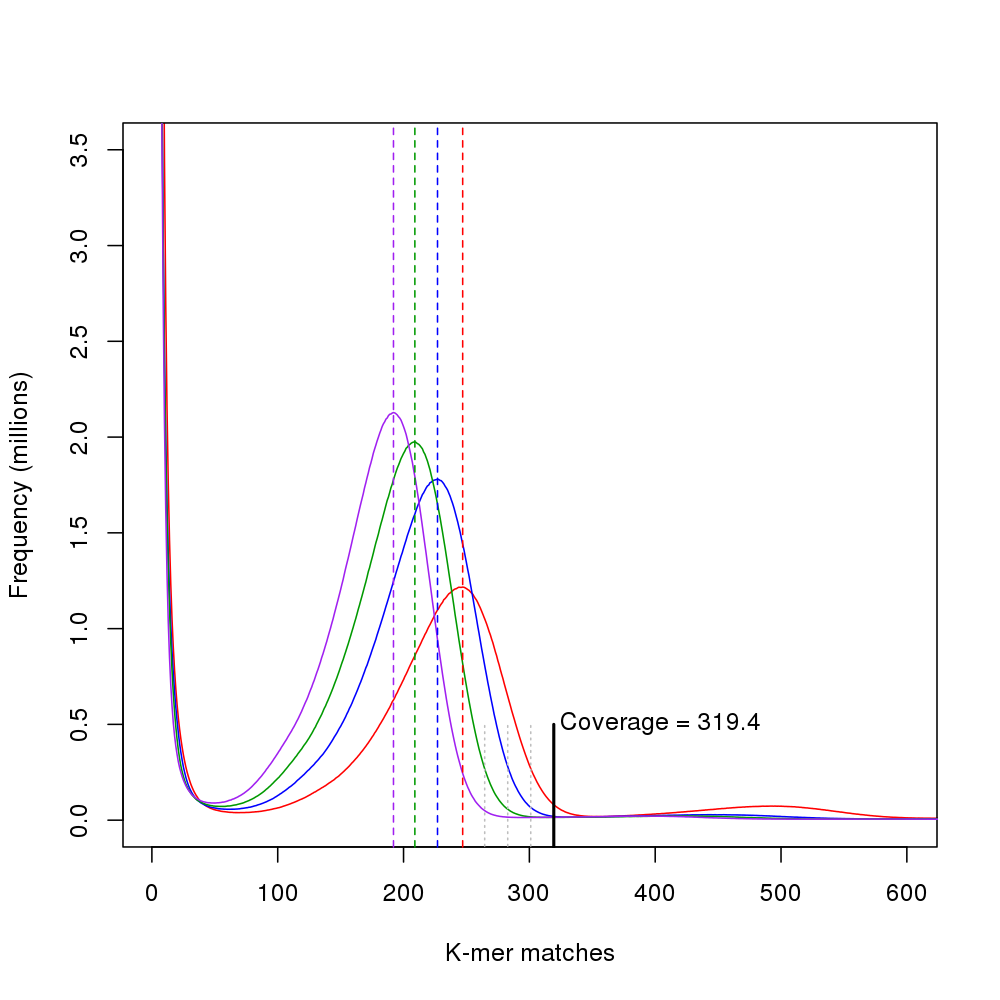

# Genome size estimation

[Jellyfish] version [2.1.3] was used to count *k*-mer distributions in the raw genomic short read data.
The *k*-mer coverage *C<sub>k</sub>* was determined for several values of *k*: 17, 21, 25, and 29.
A linear model of *C<sub>k</sub>* as a function of *k* was fit to compute the estimated nucleotide coverage *C = C<sub>1</sub>* and genome size.
The *k*-mer histogram files have been deposited in the Pdom Data Store at `r1.2/genome-size-est/`.

## Prerequisites

  - [Jellyfish] (originally done with version 2.1.3)
  - fastq-dump program (from the [SRA Toolkit])
  - [R] (and the `Rscript` interpreter that comes bunded with it)

## Procedure (interactive)

First, designate the number of available processors.
This will run multiple jobs/threads at once to speed up computations.
For a laptop or a desktop, this will usually be 4, 8, or 16.
For server or HPC hardware, you mave have as many as 32 to 64 processors at your disposal.

```bash
NumThreads=16
```

Next, download short reads from the NCBI SRA and convert to Fastq format.

```bash
../GetGenomeSRA.make -j $NumThreads
```

Then, count *k*-mers and produce *k*-mer frequency histograms.

```bash
FastqFiles=$(ls *.fq)
for k in  17 21 25 29
do
  jellyfish count -m $k -s 100M -t $NumThreads -C -o pdom-${k}mers.jf $FastqFiles
  jellyfish histo pdom-${k}mers.jf > pdom-${k}mers.hist
done
```

Finally, estimate *k*-mer coverage, genome coverage, and genome size.

```bash
./size-coverage-estimate.R
```



Clean up huge data files.

```bash
rm *.sra *.fastq *.fq *.jf
```

## Procedure (automated)

The same procedure can also be run in batch mode using the following commands (in the `genome-size` directory).

```bash
../GetGenomeSRA.make -j 16
make NumThreads=16
make clean
rm *.sra *.fastq *.fq
```

## References

- **Marçais G, Kingsford C** (2011) A fast, lock-free approach for efficient parallel counting of occurrences of k-mers. *Bioinformatics* **27**:764-70, [doi:10.1093/bioinformatics](http://dx.doi.org/10.1093/bioinformatics).

<!-- GitHub Markdown does not render FTP links correctly, thus the bit.ly link for [2.1.3]. -->
<!-- Should be ftp://ftp.genome.umd.edu/pub/jellyfish/jellyfish-2.1.3.tar.gz                -->

[Jellyfish]: http://www.genome.umd.edu/jellyfish.html
[2.1.3]: http://bit.ly/1yCpaUQ
[SRA Toolkit]: http://www.ncbi.nlm.nih.gov/Traces/sra/sra.cgi?view=software
[R]: https://www.r-project.org/
