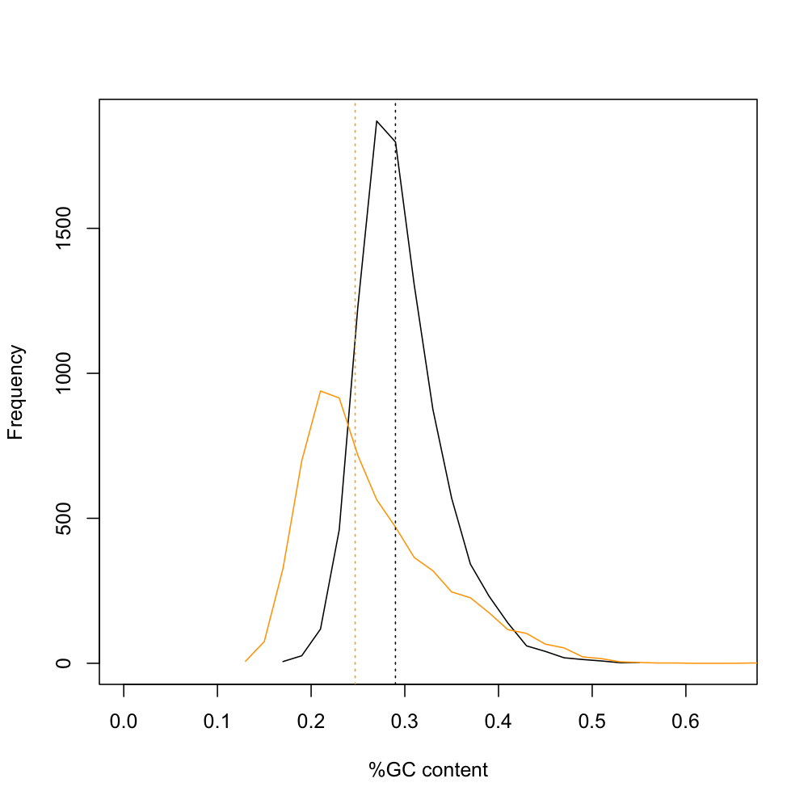

# Interval loci

The LocusPocus program ([AEGeAn Toolkit][] version [53d092091c][]) was used to compute interval loci (iLoci) from the genome annotation.
The xtractore program was used to extract the iLocus sequences from the genome sequence.
The iLocus sequences and annotations have been deposited in the Pdom Data Store at `/r1.2/interval-loci`.

## Procedure (interactive)

We first need the genome sequence and corresponding annotations.

```bash
PdomData=/iplant/home/standage/Polistes_dominula/r1.2
iget ${PdomData}/genome-annotation/pdom-annot-r1.2.gff3
iget ${PdomData}/genome-assembly/pdom-scaffolds-unmasked-r1.2.fa.gz
gunzip pdom-scaffolds-unmasked-r1.2.fa.gz
```

Then we compute the iLocus coordinates, excluding gene-less iLoci if they are at the end of a scaffold.

```bash
locuspocus --intloci --skipends \
           --delta=500 --verbose \
           --outfile=pdom-loci-r1.2.gff3 \
           pdom-annot-r1.2.gff3
```

The xtractore program gives us the iLocus sequences.

```bash
xtractore --type=locus --outfile=pdom-loci-r1.2.fa \
          pdom-loci-r1.2.gff3 \
          pdom-scaffolds-unmasked-r1.2.fa
```

For some analyses, we want gene coordinates expressed in reference to the iLocus to which they belong, as opposed to the entire scaffold.
We transformed the annotations to iLocus-based coordinates and created two files, one including tRNA genes and one without.

```bash
perl glb2lcl.pl < pdom-loci-r1.2.gff3 \
    | gt gff3 -retainids -sort -tidy -o pdom-annot-r1.2-iloci.gff3
    
perl glb2lcl.pl < pdom-loci-r1.2.gff3 \
    | grep -v -e trnascan -e PdomTRNA \
    | gt gff3 -retainids -sort -tidy -o pdom-annot-r1.2-iloci-sanstrna.gff3
```

### Comparison of genome composition

At the level of large genomic sequences (> 1Mbp), *P. dominula* has the most AT-rich genome observed in Hymenoptera.
For comparative evaluation of genome composition at the level of gene loci, we collected data for 13 Hymenopteran species: see ``hymenoptera-ilocus-stats-2014.tsv``.
We applied several filters to the data, selecting loci within the 10% and 90% quantiles in length, containing a single gene, and no more than 25% ambiguous nucleotides.
We then compared the nucleotide composition of *P. dominula* to that of *Apis mellifera*, noting that the trend is reversed at the resolution of individual genes.

```R
# Import data
data <- read.table("hymenoptera-ilocus-stats-2014.tsv", header=TRUE, sep="\t")

# Filter by number of genes
data.sub <- data[data$GeneCount == 1,]

# Filter by N content
data.sub <- data.sub[data.sub$Ncontent < 0.25,]

# Filter by length quantiles
qnt <- quantile(data.sub$Length, probs=c(0.1, 0.9))
data.sub <- data.sub[data.sub$Length > qnt[1] & data.sub$Length < qnt[2],]

# Plot Amel vs Pdom
pdom <- data.sub[substr(data.sub$ID, 1, 4) == "Pdom",]
amel <- data.sub[substr(data.sub$ID, 1, 4) == "Amel",]
pdom.h <- hist(pdom$GCcontent, breaks=25, plot=FALSE)
amel.h <- hist(amel$GCcontent, breaks=25, plot=FALSE)
cat(sprintf("Pdom median: %.1f\n", median(pdom$GCcontent)*100))
cat(sprintf("Amel median: %.1f\n", median(amel$GCcontent)*100))
png("amel-pdom-iloci-gc.png", height=1000, width=1000, res=150)
plot(pdom.h$mids, pdom.h$counts, type="l", xlab="%GC content", ylab="Frequency", xlim=c(0,0.65))
lines(amel.h$mids, amel.h$counts, col="orange")
abline(v=median(pdom$GCcontent), lty=3)
abline(v=median(amel$GCcontent), lty=3, col="orange")
d <- dev.off()
```



## Procedure (automated)

The same procedure can also be run in batch mode using the following commands (in the `interval-loci` directory).

```bash
make
make clean
```

[AEGeAn Toolkit]: http://standage.github.io/AEGeAn
[53d092091c]: https://github.com/standage/AEGeAn/tree/53d092091c928136d5ab2d031dcd32f293ce3a4f
[d72e59a]: https://github.com/standage/AEGeAn/tree/d72e59ad0012f69fa2fd036f4d715af3ca72d1ab
